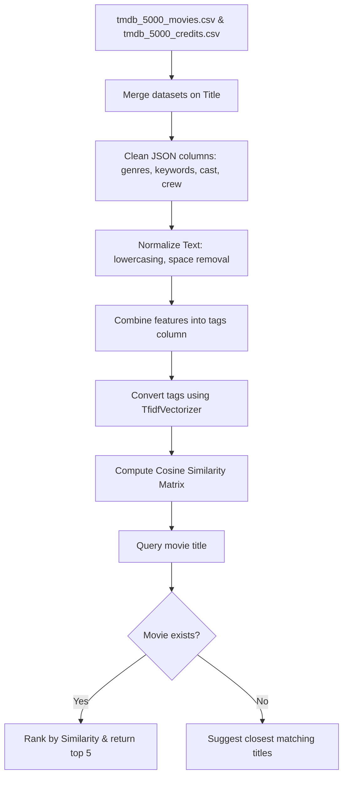

# Cinematch: Movie Recommendation System 🎬

A content-based movie recommendation system built as a college lab mini-project. It analyzes movie metadata—such as genres, plot keywords, overview descriptions, cast, and directors—to recommend the top 5 most similar movies based on user input.

Instead of using a single monolithic notebook, this project is split into clean, modular notebooks (`preprocessing.ipynb`, `recommendation.ipynb`, `main.ipynb`, `app.ipynb`) which are dynamically loaded and executed as Python modules using a custom import hook. It supports both an interactive command-line interface (CLI) and a web-based dashboard using Streamlit.

---

## 🚀 Features
- **Modular Code Architecture**: Code is cleanly separated into logic layers for data cleaning, model building, interactive CLI, and web UI.
- **Custom Notebook Finder Hook**: Implements a custom class (`NotebookFinderAndLoader`) that hooks into Python's module resolution system, allowing Jupyter Notebooks (`.ipynb` files) to be imported directly as if they were standard `.py` files.
- **Robust Text Normalization**: Extracts names from nested JSON fields, converts strings to lowercase, and strips spaces from multi-word terms (e.g., "Johnny Depp" becomes "johnnydepp") to ensure actors/directors/genres are kept as unified tokens.
- **TF-IDF Vectorization**: Uses `TfidfVectorizer` instead of `CountVectorizer` to down-weight generic words and emphasize unique plot tags, directors, and actors.
- **Fuzzy Search & Suggestions**: If a user enters a misspelled or partially matched movie title, the CLI/UI suggests up to 3 close matches from the database.
- **Streamlit Web Dashboard**: A web interface for searching and viewing movie recommendations in a clean, visual format.

---

## 🛠️ Technologies Used
- **Python**: Core programming language.
- **Pandas & NumPy**: For dataset loading, merging, and matrix operations.
- **Scikit-Learn**: For text feature extraction (`TfidfVectorizer`) and vector distance calculations (`cosine_similarity`).
- **Streamlit**: For the interactive web dashboard.
- **Jupyter Notebooks**: As the interactive development and execution environment.

---

## 📊 Dataset Information
This project utilizes the **TMDB 5000 Movie Dataset** (available on Kaggle). It consists of two CSV files:
1. `tmdb_5000_movies.csv`: Contains metadata such as budget, genres, homepage, id, keywords, original language, original_title, overview, popularity, release_date, revenue, runtime, status, tagline, title, vote_average, and vote_count.
2. `tmdb_5000_credits.csv`: Contains details on the movie crew and cast members (`movie_id`, `title`, `cast`, `crew`).

### Preprocessing and Merging:
The two files are merged on the `title` column, and we keep only the features relevant for content-based recommendations:
- `movie_id`
- `title`
- `overview` (brief storyline description)
- `genres` (action, comedy, drama, etc.)
- `keywords` (plot-specific tags)
- `cast` (retains only the top 3 actors)
- `crew` (retains only the director)

---

## 📈 Project Workflow



1. **Data Ingestion**: Load the CSV datasets, merge them on the `title` column, and drop rows with missing values.
2. **Feature Extraction**: Parse stringified lists of dictionaries in `genres`, `keywords`, `cast`, and `crew` columns. Extract name values, capturing only the top 3 actors for the cast and the director for the crew.
3. **Space Removal**: Strip spaces inside multi-word tags (e.g., "Science Fiction" $\rightarrow$ "sciencefiction") so they are treated as single terms during vectorization.
4. **Tag Compilation**: Combine the words from `overview`, `genres`, `keywords`, `cast`, and `crew` into a single lowercase text column named `tags`.
5. **Vectorization**: Fit the `tags` column using a `TfidfVectorizer` limited to the top 5000 most frequent words (excluding English stop words).
6. **Similarity Calculation**: Compute a pairwise cosine similarity matrix of shape $(N, N)$ where $N$ is the number of movies.
7. **Recommendation Lookup**: Locate the index of the queried movie, fetch its corresponding similarity scores, sort them in descending order, and extract the top 5 highest-scoring movies (excluding the query movie itself).

---

## 🧠 Recommendation Method Used
The project implements a **Content-Based Filtering** recommendation model. This method suggests items to a user by matching their profile (or characteristics of items they like) to the metadata of other items. In this project, the metadata includes genres, plot details, key actors, and the director.

To measure how similar two movies are in our 5000-dimensional vector space, we calculate their **Cosine Similarity**. Cosine Similarity calculates the cosine of the angle between two non-zero vectors:

$$\text{similarity}(\vec{u}, \vec{v}) = \cos(\theta) = \frac{\vec{u} \cdot \vec{v}}{\|\vec{u}\| \|\vec{v}\|}$$

The score ranges between **0 and 1**:
- A score near **1** means the two movies share highly similar tags and characteristics.
- A score near **0** means there is little to no similarity between them.

---

## 🔍 TF-IDF Explanation (Why not CountVectorizer?)
A common approach for content-based recommenders is using `CountVectorizer`, which counts the absolute frequency of each word in a document. However, this project implements `TfidfVectorizer` (Term Frequency-Inverse Document Frequency) instead.

Here is why `TfidfVectorizer` yields better recommendations:
- **CountVectorizer Limitation**: It treats all words equally. Common words like "man", "discover", "saves", or generic genre terms that appear across hundreds of movies will get high counts, skewing similarity calculations towards generic matches.
- **TF-IDF Strength**: It scales down the weight of words that occur too frequently across the entire corpus (e.g., common verbs or generic adjectives) and scales up the weight of rare, highly descriptive words (e.g., specific sci-fi tags, distinct director/actor names, or unique plot elements).

Mathematically:
$$\text{TF-IDF} = \text{TF}(t, d) \times \text{IDF}(t, D)$$

Where:
- $\text{TF}(t, d)$ measures how often term $t$ appears in movie document $d$.
- $\text{IDF}(t, D) = \log\left(\frac{N}{1 + |\{d \in D : t \in d\}|}\right)$ measures how common or rare term $t$ is across all $N$ movies.

By using TF-IDF, the similarity metric focuses on the unique features that truly define a movie, rather than superficial word matches.

---

## 📂 Folder Structure
The workspace is organized as follows:
```text
├── tmdb_5000_movies.csv       # Movie metadata dataset (Kaggle)
├── tmdb_5000_credits.csv      # Movie credits and cast dataset (Kaggle)
├── preprocessing.ipynb        # Data cleanup and feature engineering module
├── recommendation.ipynb       # TF-IDF vectorizer and Cosine Similarity model
├── main.ipynb                 # Interactive CLI loop with custom import hook
├── app.ipynb                  # Streamlit web interface
└── eda.ipynb                  # Exploratory Data Analysis & experimentation notebook
```

---

## ⚙️ Installation Steps

### 1. Clone or Download the Project
Download the repository files to your local machine.

### 2. Download the Datasets
Download the TMDB 5000 Movie Dataset from Kaggle:
- Link: [Kaggle - TMDB 5000 Movie Dataset](https://www.kaggle.com/datasets/tmdb/tmdb-movie-metadata)
- Place both `tmdb_5000_movies.csv` and `tmdb_5000_credits.csv` in the root folder of the project.

### 3. Set Up a Virtual Environment (Recommended)
Open your terminal inside the project directory and run:
```bash
# Create a virtual environment
python -m venv venv

# Activate the virtual environment
# On Windows (Command Prompt)
venv\Scripts\activate
# On Windows (PowerShell)
.\venv\Scripts\Activate.ps1
# On macOS/Linux
source venv/bin/activate
```

### 4. Install Dependencies
Install the required scientific computing, machine learning, and UI libraries:
```bash
pip install numpy pandas scikit-learn streamlit ipykernel
```

---

## 💻 How to Run the Project

### Method 1: Running the Interactive CLI
The `main.ipynb` notebook is designed to run directly as a CLI program. You can execute it via Jupyter or run it using Python by loading it in a Jupyter environment. 

Alternatively, if you want to run it from a standard terminal session, you can start the Jupyter interface:
```bash
jupyter notebook
```
Open `main.ipynb` and run the cells. The notebook sets up a terminal-like input prompt inside your browser.

If you convert the notebooks to standard Python scripts:
```bash
jupyter nbconvert --to script main.ipynb preprocessing.ipynb recommendation.ipynb
python main.py
```

### Method 2: Running the Streamlit Web Application
To launch the interactive dashboard interface in your web browser:
1. If you convert the notebooks to standard Python scripts first:
   ```bash
   jupyter nbconvert --to script app.ipynb preprocessing.ipynb recommendation.ipynb
   streamlit run app.py
   ```
2. Or, if your environment supports running Streamlit directly on notebooks:
   ```bash
   streamlit run app.ipynb
   ```
This will spin up a local web server (typically at `http://localhost:8501`) where you can search for movies and see the recommendations instantly.

---

## 📝 Example Usage

### CLI App Run Example:
```text
Loading data...
Building model...
Done. 4806 movies loaded.

Enter movie name (or 'quit' to exit): Avatar

Top 5 Recommended Movies:
1. Aliens vs Predator: Requiem
2. Aliens
3. Falcon Rising
4. Independence Day
5. Titan A.E.

Enter movie name (or 'quit' to exit): Inceptin
Movie 'Inceptin' not found in dataset.
Did you mean: ['Inception']

Enter movie name (or 'quit' to exit): Inception

Top 5 Recommended Movies:
1. Duplicity
2. The Dark Knight Rises
3. Timecop
4. Star Trek Into Darkness
5. Chicago Overcoat

Enter movie name (or 'quit' to exit): quit
```

---

## 🔮 Future Improvements
- **Hybrid Recommendation**: Combine content-based filtering with collaborative filtering using user rating data (e.g., using SVD or KNN algorithms) to offer more personalized results.
- **TMDB API Integration**: Fetch real-time movie poster links, synopsis details, and trailer links directly from the TMDB API to show in the Streamlit application interface.
- **Improved NLP Processing**: Use stemming or lemmatization (e.g., NLTK's PorterStemmer) to group similar words like "run", "running", "ran" to improve tag comparison accuracy.
- **Deployment**: Deploy the Streamlit application to Streamlit Cloud or Hugging Face Spaces for public access.

---

## 📌 Conclusion
This Movie Recommendation System demonstrates how basic text cleaning, feature combination, and vector space mathematics (TF-IDF and Cosine Similarity) can be used to construct a functional recommendation model. It serves as an excellent introduction to Natural Language Processing (NLP) concepts and recommendation systems for undergraduate computer science students.

---

## 👥 Authors
- **[Your Name]** (Roll No: CSE003) - Core Model & Streamlit App Development
- **[Partner's Name]** (Roll No: CSE049) - Data Preprocessing & CLI Setup
*Submitted as a Mini Project for the Computer Science & Engineering Department (Academic Session 2024-2025).*
